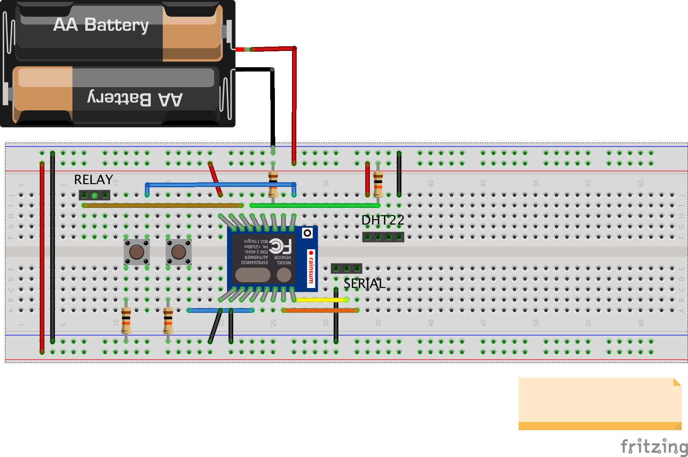

This demonstates a simple test of the esp8266 to read from DHT22 temperature sensor and run a web server to display status and control a relay.
The code is written for the NodeMCU firmware.

# The Hardware

## Parts
1. esp8266 (I used esp8266-12F)
2. DHT22 or DHT11 temperature sensor
3. 2 switches
4. 4 10k resistors
5. 3.3V power supply
6. TTL-USB serial cable (FTDI) to connect the USB port on your computer to the TX/RX lines on the esp8266
7. relay (optional)

# Instructions
1. Flash the NodeMCU firmware to the board. This allows you to have the chip run simple lua scripts, and has an extensive API. See http://nodemcu-build.com/ for more info. 
I used [http://nodemcu.readthedocs.io/en/dev/en/build]() . You must add the "DHT" and "net" modules to the firmware for this project to work.
1. Upload the code to the board. 
	* The way I did this is by installing [https://github.com/4refr0nt/luatool](), which requires python2.7 and pyserial. I added the  luatool.py to my path. Initially, you must use a serial connection. My code also adds a telnet connection on port 80 so that you can upload code until your code causes an error and you then you have to go back to serial (good for small changes).

# The Software
I based the structure on [https://github.com/Malte-D/nodemcu-http-telnet]()
which demonstrates how to write an http server while maintaining telnet support on port 80 to upload code.

 * `init.lua` : initialization script for the chip
 * `server.lua`: the main server application
 * `test.lua` : script for testing that I can upload to the device over the wifi network
 * `upload`: shell script that uses `luatool` to  upload code to the chip
